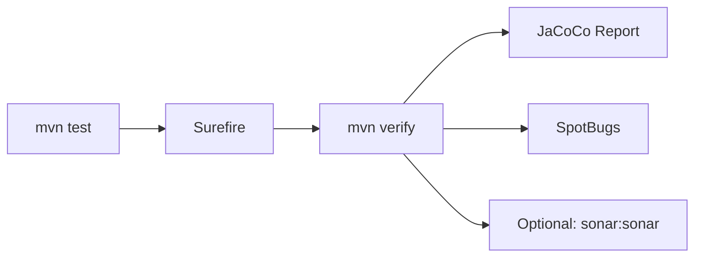

# Academic Result Evaluation Platform (only for demo)

<div align="center">

[](https://openjdk.org/)
[](https://spring.io/projects/spring-boot)
[](https://maven.apache.org/)
[](./src/test/java)
[](https://www.jacoco.org/jacoco/)
[](https://www.sonarqube.org/)

**Spring Boot reference app for automated testing, coverage, and static analysis in Maven CI/CD pipelines.**

[Quick Start](#quick-start) · [Quality Pipeline](#quality-pipeline) · [API](#api-reference) · [Project Layout](#project-layout)

</div>

---

## Overview

An **academic result evaluation service** (pass threshold: **40 marks**, valid range: **0–100**) used to demonstrate production-style Java quality practices:

- **Unit tests** executed automatically via the Maven Surefire Plugin
- **Code coverage** reported with JaCoCo
- **Static analysis** with SpotBugs and optional SonarQube/SonarCloud upload

The application exposes a Thymeleaf web UI and a JSON REST API. Business rules live in `ResultService`; HTTP handling is in `ResultController`.

---

## Features

| Area | Description |
|------|-------------|
| Web UI | Enter marks, view pass/fail, quick-test presets |
| REST API | `GET /api/result/{marks}` returns structured JSON |
| In-app docs | `/api-docs` and `/about` (Surefire & quality tooling) |
| Test suite | 16 JUnit 5 tests (service + Spring context) |
| Quality gates | Surefire, JaCoCo, SpotBugs; optional Sonar analysis |

---

## Tech Stack

| Layer | Technology |
|-------|------------|
| Runtime | Java 17 |
| Framework | Spring Boot 3.5.14 |
| View | Thymeleaf |
| Testing | JUnit 5, Spring Boot Test |
| Build | Maven (wrapper included) |
| Plugins | Surefire 3.2.5, JaCoCo 0.8.12, SpotBugs, Sonar Scanner |

---

## Quick Start

### Prerequisites

- **JDK 17+**
- No global Maven install required — use the included wrapper (`./mvnw`)

### Run the application

```bash
git clone <repository-url>
cd sure-fire-plugin-app

./mvnw spring-boot:run
```

Open **http://localhost:8080**

### Run tests (Surefire)

```bash
./mvnw clean test
```

Expected output:

```text
Tests run: 16, Failures: 0, Errors: 0, Skipped: 0
BUILD SUCCESS
```

Reports: `target/surefire-reports/`

---

## Quality Pipeline



### Commands

| Command | Purpose |
|---------|---------|
| `./mvnw clean test` | Unit tests only (fast feedback) |
| `./mvnw clean verify` | Tests + JaCoCo HTML/XML + SpotBugs |
| `./mvnw clean verify -Pquality-gate` | Above + 80% line coverage on `service` package |
| `./mvnw clean verify -Pskip-spotbugs` | Tests + coverage without SpotBugs |

### Reports

| Report | Path |
|--------|------|
| Test results | `target/surefire-reports/` |
| Coverage (HTML) | `target/site/jacoco/index.html` |
| Coverage (XML, for Sonar) | `target/site/jacoco/jacoco.xml` |

### SonarCloud / SonarQube

1. Create a project at [SonarCloud](https://sonarcloud.io) or on your SonarQube server.
2. Generate an analysis token.
3. Run (replace placeholders):

```bash
export SONAR_TOKEN=<your-token>

./mvnw clean verify sonar:sonar \
  -Dsonar.host.url=https://sonarcloud.io \
  -Dsonar.organization=<your-organization> \
  -Dsonar.projectKey=com.demo:academic-result-platform
```

Defaults are in [`sonar-project.properties`](./sonar-project.properties). JaCoCo XML is consumed automatically via `pom.xml` properties.

### Coverage scope

Tests focus on `ResultService` (15 cases + 1 context test). Controller endpoints are not yet covered by `@WebMvcTest`; project-wide coverage will appear lower in Sonar until those tests are added. The `quality-gate` profile enforces **80% line coverage on the service layer only**.

---

## API Reference

| Method | Endpoint | Description |
|--------|----------|-------------|
| `GET` | `/` | Home page (result form) |
| `GET` | `/check?marks={0-100}` | Web result view |
| `GET` | `/api/result/{marks}` | JSON result |
| `GET` | `/api-docs` | API documentation page |
| `GET` | `/about` | Surefire & quality tooling overview |

**Example — `GET /api/result/75`**

```json
{
  "marks": 75,
  "result": "Pass",
  "message": "Congratulations! You passed."
}
```

**Invalid input — `GET /api/result/150`**

```json
{
  "marks": 150,
  "result": "Error",
  "message": "Invalid marks! Please enter marks between 0 and 100."
}
```

---

## Test Coverage

`ResultServiceTest` includes scenarios for:

- Pass and fail paths (typical marks)
- Boundary values (39, 40, 41)
- Edge cases (0, 100)
- Parameterized and consistency checks

Surefire discovers classes matching `*Test.java` and `*Tests.java` during the `test` phase and **fails the build** on any failure—suitable for CI quality gates.

---

## Project Layout

```text
sure-fire-plugin-app/
├── pom.xml                          # Build, Surefire, JaCoCo, SpotBugs, Sonar
├── sonar-project.properties         # Sonar scanner defaults
├── mvnw, mvnw.cmd                   # Maven wrapper
├── src/main/java/.../surefiretest/
│   ├── SurefiretestdemoApplication.java
│   ├── controller/ResultController.java
│   └── service/ResultService.java
├── src/main/resources/
│   ├── application.properties
│   └── templates/                   # index, api-docs, about
└── src/test/java/.../
    ├── SurefiretestdemoApplicationTests.java
    └── service/ResultServiceTest.java
```

---

## Screenshots

Place images under `screenshots/` to render below:

| File | Content |
|------|---------|
| `home-page.png` | Main UI |
| `api-docs.png` | API docs page |
| `about-surefire.png` | About / Surefire page |
| `test-results.png` | `mvn test` terminal output |

```bash
mkdir -p screenshots
```

---

## DevOps Relevance

Typical pipeline flow mirrored by this project:

1. **Commit / PR** triggers `./mvnw clean verify -Pquality-gate`
2. **Surefire** blocks merge on test failure
3. **JaCoCo** publishes coverage metrics
4. **SpotBugs / Sonar** surface defects and quality regressions
5. **Deploy** only after the build is green

---

## Author

**Anurag Maurya**

---

## License

Free for learning and demonstration purposes.
